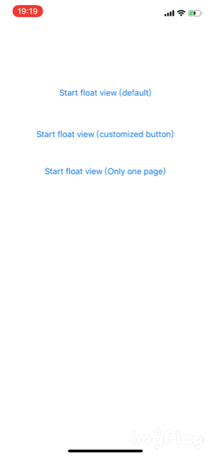

# VCFloatView
Awesome float view with queue for iOS

# Introduction

VCFloatView makes float views pop up and dismiss according to their priority. It uses two queues (high and low priority queue) to store float views.

You can customize actions after dimissing, with the help of Block in Objective-C. It's easy to use, you can refer to ViewController.m.

# Demo

